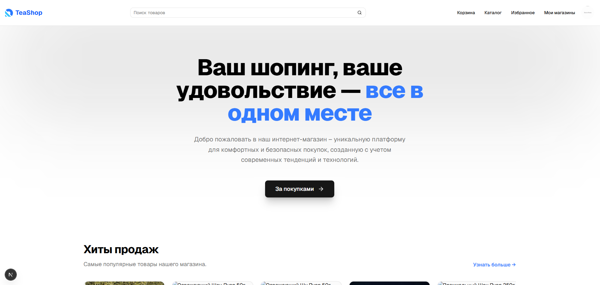
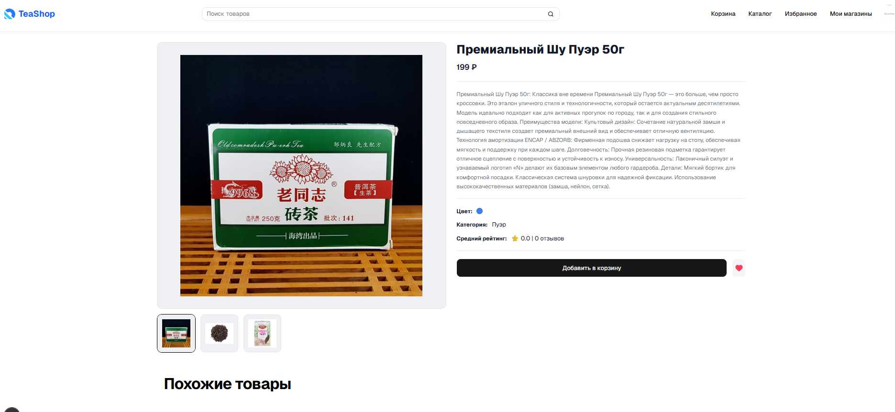
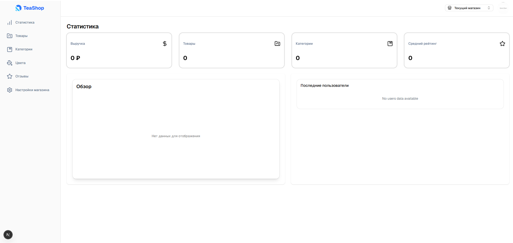

# TEASHOP

Интернет-магазин (admin/dashboard + витрина) на Next.js (client-side) и NestJS + Prisma + Postgres (server-side).

## Стек

- Client:
  - Next.js 16 (App Router)
  - React 19
  - TypeScript
  - TailwindCSS
  - shadcn/ui + Radix UI
  - TanStack Query (React Query)
  - Zustand
  - React Hook Form
  - Axios
  - Chart.js / Recharts
- Server:
  - NestJS 11
  - TypeScript
  - JWT Auth (`@nestjs/jwt`)
  - Passport (Google OAuth)
  - Cookie-based auth (`cookie-parser`)
  - Validation (`class-validator`, `class-transformer`)
  - File uploads (Multer)
  - Swagger (`@nestjs/swagger`)
- DB:
  - PostgreSQL
  - Prisma ORM (+ `@prisma/adapter-pg`)
- Integrations:
  - YooKassa (`@a2seven/yoo-checkout`)

## Требования

- Node.js (рекомендуется LTS)
- PostgreSQL

## Скриншоты





## Быстрый старт (локально)

### 1) Установка зависимостей

```bash
npm install
```

### 2) Переменные окружения

Создай файлы окружения из примеров:

- `server-side/.env` из `server-side/.env.example`
- `client-side/.env.local` из `client-side/.env.local.example`

### 3) Подготовка базы данных (Prisma)

Укажи корректный `DATABASE_URL` в `server-side/.env`, затем:

```bash
npm run prisma:migrate
npm run prisma:seed
```

### 4) Запуск

```bash
npm run dev
```

- Client: http://localhost:3000
- Server: http://localhost:5000

## Переменные окружения

### Server (`server-side/.env`)

- `DATABASE_URL`
- `CLIENT_URL` (например `http://localhost:3000`)
- `SERVER_URL` (например `http://localhost:5000`)
- `COOKIE_DOMAIN` (для локалки обычно `localhost`)
- `JWT_SECRET`
- `JWT_ACCESS_TOKEN_TTL`
- `JWT_REFRESH_TOKEN_TTL`
- `GOOGLE_CLIENT_ID`
- `GOOGLE_CLIENT_SECRET`
- `YOUKASSA_SHOP_ID`
- `YOUKASSA_SECRET_KEY`

### Client (`client-side/.env.local`)

- `NEXT_PUBLIC_SERVER_URL` (например `http://localhost:5000`)
- `APP_ENV`
- `APP_URL`
- `APP_DOMAIN`

## Полезные команды

- `npm run dev` — запустить server + client
- `npm run build` — сборка
- `npm run lint` — линтеры
- `npm run prisma:migrate` — миграции
- `npm run prisma:seed` — сидирование
